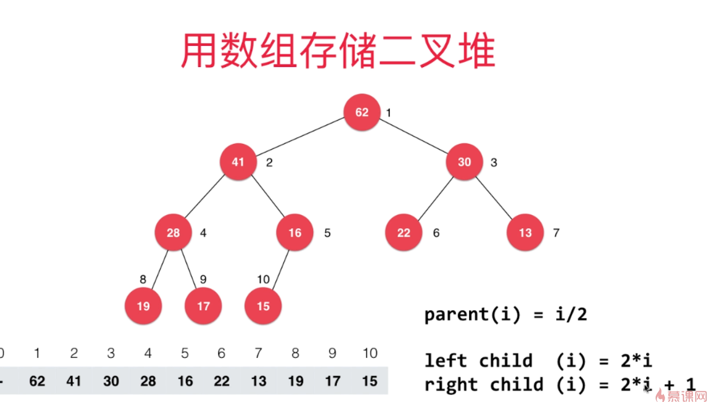

# 用堆来实现优先队列
优先队列本质上就是队列，但是出队会得到最大或者最小的元素。

采用普通线性来实现优先队列的话
- 入队O(1)
- 出队O(n)

采用顺序线性的来实现优先队列的话
- 入队O(n)
- 出队O(1)

采用堆来实现优先队列的话
- 入队O(log n)
- 出队O(log n)

所以采用堆为底层来实现优先队列。

# 关于堆
采用堆来实现优先队列的堆其实是二叉堆，而且二叉堆还是一颗完全二叉树，这里复习一下二叉树的东西：
- 满二叉树：除了叶子节点外，所有的节点都有左孩子和右孩子
- 完全二叉树：按顺序排成树的样子就是完全二叉树。可以发现完全二叉树和满二叉树的区别就是如果完全二叉树出现节点的空缺，那么缺失的地方一定是树的右下方。
- 二叉堆：
  - 1.和完全二叉树有一样的结构，2.而且二叉堆中每一个节点的值都不大于其父节点的值(最大堆)，最小堆就是最大堆的反过来。
  - 要注意到最大二叉堆保证的是每个节点的值都小于等于父节点的值，所以不一定最大二叉堆的值越往下越小。 
  - 二叉最大堆节点的值的大小和它所在的层次是没有关系的，它只和自己的父节点的大小有关系(因为完全二叉树的性质，二叉堆具有完全二叉树和节点和父节点的关系的两个性质)

因为完全二叉树的特性，所以我们可以用数组来表示一颗完全二叉树。

我们可以用索引的计算来快速找到每个节点的左右孩子和父亲的索引

