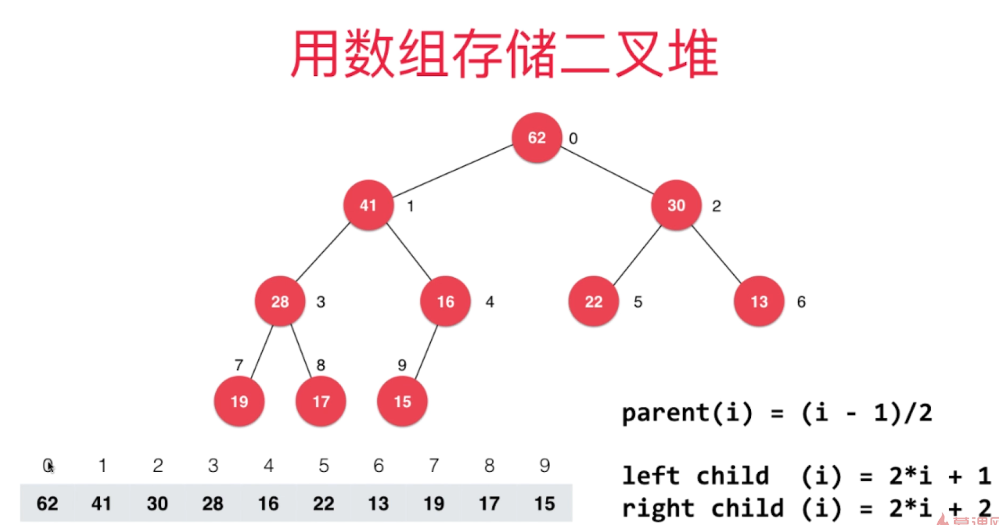

# 用堆来实现优先队列
优先队列本质上就是队列，但是出队会得到最大或者最小的元素。

采用普通线性来实现优先队列的话
- 入队O(1)
- 出队O(n)

采用顺序线性的来实现优先队列的话
- 入队O(n)
- 出队O(1)

采用堆来实现优先队列的话
- 入队O(log n)
- 出队O(log n)

所以采用堆为底层来实现优先队列。

# 关于堆
采用堆来实现优先队列的堆其实是二叉堆，而且二叉堆还是一颗完全二叉树，这里复习一下二叉树的东西：
- 满二叉树：除了叶子节点外，所有的节点都有左孩子和右孩子
- 完全二叉树：按顺序排成树的样子就是完全二叉树。可以发现完全二叉树和满二叉树的区别就是如果完全二叉树出现节点的空缺，那么缺失的地方一定是树的右下方。
- 二叉堆：
  - 1.和完全二叉树有一样的结构，2.而且二叉堆中每一个节点的值都不大于其父节点的值(最大堆)，最小堆就是最大堆的反过来。
  - 要注意到最大二叉堆保证的是每个节点的值都小于等于父节点的值，所以不一定最大二叉堆的值越往下越小。 
  - 二叉最大堆节点的值的大小和它所在的层次是没有关系的，它只和自己的父节点的大小有关系(因为完全二叉树的性质，二叉堆具有完全二叉树和节点和父节点的关系的两个性质)

因为完全二叉树的特性，所以我们可以用数组来表示一颗完全二叉树。

我们可以用索引的计算来快速找到每个节点的左右孩子和父亲的索引，上图的索引是从1开始存储完全二叉树的内容的，其实从0开始也是可以的。

## 堆的插入元素操作
插入操作总结下来其实就是
1. 先把要添加的元素放到数组末尾，(因为是数组末尾，自然是完全二叉树的最底部)
2. 进行Sift Up操作(因为添加了新元素，原有堆的性质可能会被破坏，所以要对插入的元素进行一个sift up，看看这个新节点是否比自己的父节点大，如果大就和这个父节点交换值，然后继续和原来父节点的父节点进行比较，大的话继续交换；如果小就siftup完成)。
```java
/**
* 往堆中添加元素，包括给数组末尾添加元素和对末尾元素进行siftup操作
*
* @param e 要添加的元素
*/
public void add(E e) {
    data.addLast(e);
    //对末尾元素进行siftup操作
    siftUp(data.getSize() - 1);
}

/**
* 上浮操作，其实也是维护堆的性质的一个操作，因为往数组末尾添加了元素，堆的性质可能会被
* 破坏，所以对数组末尾元素进行siftup操作
*
* @param k k一开始是数组末尾
*/
private void siftUp(int k) {
    //循环比较k是否比父节点大，如果大就交换k和父节点的值
    //终止条件是当k是根节点的时候或者k比父节点小的时候
    while (k > 0 && data.get(parent(k)).compareTo(data.get(k)) < 0) {
        data.swap(k, parent(k));
        k = parent(k);
    }
}
```

## 堆的查看最大元素
因为堆的性质，父节点大于子节点的值，所以根节点一定是最大的元素。

## 堆的出堆操作
操作可以归纳为两个
1. 交换数组的第一个元素和最后一个元素
2. 对数组第一个(原最后一个元素)进行siftdown操作。siftdown操作其实和siftup操作一样都是为了维护堆的性质。每次进行siftdown的节点都要和该节点的左右孩子进行比较，比较完后该节点和左右孩子的大的节点进行交换(这点不难理解，因为要维护最大堆的性质，自然和大的换)
   
```java
/**
* 从堆中删除最大的元素
*
* @return 返回最大元素
*/
public E extractMax() {
    E res = findMax();

    //为了简化操作，这里采用把最后一个元素放到根节点这里,因为原来的根节点被删除了
    data.swap(0, data.getSize() - 1);
    //删除数组中最后一个元素
    data.removeLast();

    //因为最后一个元素到了根节点，堆的结构可能会被破坏，所以把这个点下浮下去
    siftDown(0);

    return res;
}

/**
* 下浮操作,比如下浮索引为0这个元素,让0这个元素和他的左孩子右孩子的值大的那个交换，交换后继续交换
* 知道这个节点比左孩子和右孩子节点的值都大(符合堆的性质)
*
* @param k 下浮操作开始的索引
*/
private void siftDown(int k) {
    //要确保k的左孩子和右孩子都没有越界,因为最下面一层是不用下浮的，所以直接判断他的下一层有没有越界就行
    while (leftChild(k) < data.getSize()) {
        //j是左孩子的索引
        int j = leftChild(k);
        //如果j的右孩子存在并且右孩子的值大于左孩子，就把j更新为右孩子的索引值
        if (j + 1 < data.getSize() && data.get(j + 1).compareTo(data.get(j)) > 0) {
            j = rightChild(k);
        }

        //如果当前节点的值大于左右孩子的最大值，就退出循环
        if (data.get(k).compareTo(data.get(j)) >= 0) {
            break;
        }

        //正常的就是交换
        data.swap(k, j);
    }
}
```

## heapify和replace操作
replace操作：先让堆进行一个出队，然后再让给S堆里面添加一个新的元素。表面看上去就像“替换了一个最大元素”，不过堆顶元素和新的元素没什么太大关系。
莽的一想，应该是先出堆extractMax()操作，然后add(e)操作，但是这样是两个O(log n)操作，其实可以和出堆操作差不多，先保留堆顶元素然后把replace传入的元素放到数组头部，然后对数组头进行siftdown操作。这样就只有一个O(log n)操作。

heapify操作：让任意的数组变成堆的形状。
莽的一想：最简单的做法就是造一个堆，然后把数组里面所有的数都进行入堆，但是这种做法不是最好的。
最好的做法是找到最后一个非叶子节点的节点的索引，然后从这个索引开始一直到根节点，对每个节点都进行一下siftdown操作。那么问题来了，怎么找到最后一个非叶子节点的索引，这个节点其实就是最后一个节点的父节点，既然知道最后一个节点的索引，他的父节点的索引也就知道了，那么最后一个非叶子节点的索引也就知道了。

要知道，对于每个元素进行add操作的复杂度是O(nlogn)的，而上面说的heapify的过程是O(n)的。

## 堆的复杂度
入堆、出堆是 O(logn)

## 关于最大堆和最小堆
最大堆：优先级高的在堆顶
最小堆：优先级最低的在堆顶
因为这两个堆都是根据你来定义的优先级来自动实现堆的性质的，而优先级优势你定义的，你可以随意定义，比如在在使用最大堆的时候你也可以使用最小堆，只需要把最大堆的优先级的大小定义取反再用最小堆是一样的。所以最大堆和最小堆是可以互相替换的。
java默认的优先队列：默认的是最小堆。


# 优先队列
## 自己实现的优先队列
优先队列可以用上面实现的最大堆做底层，而且最大堆的接口可以直接被优先队列直接调用。不用做任何修改
比如说
1. 优先队列的出队对应最大堆的出堆
2. 入队对应着入堆
3. 查看队首对应着查看堆顶

## 使用优先队列
关于使用优先队列，因为java默认提供的是最小堆，因为我们无法修改java的源码，所以我们可以使用比较器Comparator接口，来实现自己的定义规则。
### 默认的最小堆，Integer中值越小优先级越高
```java
public static void main(String[] args) {
    //最小堆，默认值越小优先级越高，所以最小的值在堆顶
    PriorityQueue<Integer> q1 = new PriorityQueue<>();
    for (int i = 0; i < 10; i++) {
        q1.add(i);
    }
    while (!q1.isEmpty()){
        System.out.println(q1.remove());
    }
}
```
### 默认的最小堆，Integer中值越大优先级越高
```java
public class Test {
    public static void main(String[] args) {
        //给Integer添加一个比较器，值越大优先级越低，优先级越低，自然就在堆顶
        PriorityQueue<Integer> q1 = new PriorityQueue<>(new Comparator<Integer>() {
            @Override
            public int compare(Integer o1, Integer o2) {
                if (o1.compareTo(o2) > 0) {
                    return -1;
                } else if (o1.compareTo(o2) < 0) {
                    return 1;
                } else {
                    return 0;
                }
            }
        });
        
        for (int i = 0; i < 10; i++) {
            q1.add(i);
        }
        //打印可以发现，值是从大到小输出的，说明改变了最小堆里面的优先级。
        while (!q1.isEmpty()) {
            System.out.println(q1.remove());
        }
    }
}
```
## 总结
基础的类库中的Integer的优先队列的使用都写好了，自定义类自然也不是问题。
在使用优先队列的过程中，要注意几个问题
1. 使用什么堆(一般是最小堆，因为类库默认最小堆)。
2. 自己怎么定义优先级，要注意最小堆优先级低的在堆顶，最大堆优先级大的在堆顶。
3. 在定义优先级的时候可以选择继承Comparable类或者实现Comparator接口。

## 时间复杂度
比如最经典的N和数的前M大的元素
如果排序的复杂度就是 O(nlogn)
而是用优先队列就是 O(nlogm) 

