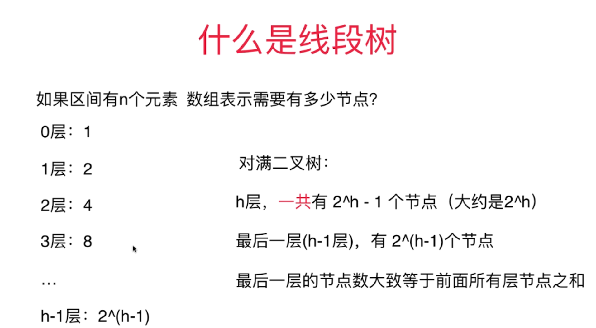
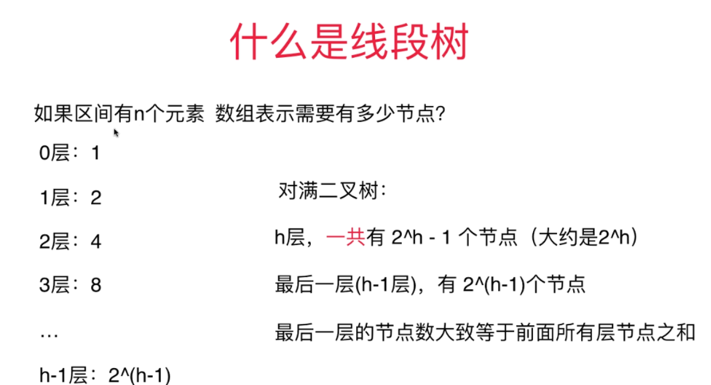

# 为什么要是用线段树
对于区间查询和区间更新
使用数组实现的话复杂度都是O(n)
使用线段树的话复杂度都是O(logn)，可以明显看出是使用线段树对于区间查询和区间更新都很快

对于线段树的使用一般都是固定的区间，只是区间内的元素可以发生变化，就是可以改查(区间或者单点都可以)，不能增删。

# 线段树的性质
线段树既不一定是完全二叉树也不是满二叉树
不过线段树是平衡二叉树。
不过话说什么是平衡二叉树？在平衡二叉树中最大深度和最小深度的差不会超过1。堆也是平衡二叉树。

这里需要知道一点，线段树的存储如果用数组存储的话，需要把它看做一颗满二叉树，只不过数组中没有值的地方就不管就行。
所以问题来了，如果区间有n个节点，数组表示的话需要有多少个节点？




假设有n个节点而且最好情况下n=2^k，因为最后一层节点个数等于前面所有层节点个数这个性质，因为n=2^k，所以最后一层节点的个数n+出最后一层的所有节点的个数n(近似于，但是比n小一点点)，一共需要2n个位置就够了，但是如果n=2^k+1，那么和原来相比，就是相对于原来多了一层，那么又要按照满二叉树来看的话，之前是2n个位置，现在又在下面多了新的一层，自然存储的位置就变成了原来的2n+新的2n = 4n。这就是用数组存储线段树为什么要4n的存储位置原因了。所以用线段树存储n个节点，需要4n个存储位置的原因。


# 线段树的操作
## 线段树的属性
1. 存储原来的数据的数组data[]：
   1. 存储原来的数据的数组,和原来的数组是一模一样的,索引从0~data.length-1
2. 线段树数组tree[]:
   1. 线段树的存储数组,大小为4倍的data数组的大小
   2. 每个非空节点都有一个treeIndex对应着tree数组中的索引，而且每个非空节点都对应着data中的一个左右区间
3. merger操作：
   1. 定义了线段树节点之间的操作
   2. 也是业务逻辑的体现

## 线段树的创建
递归创建，从tree数组中索引为0的地方开始创建，每次创建单个节点的左右节点，然后再merger左右节点的值作为此节点的区间值。
除了叶子节点，tree数组中非空节点的值都是代表一个区间的merger的结果。
```java
/**
* 创建以treeIndex为根节点的数组区间为l~r的线段树
*
* @param treeIndex 线段树根节点
* @param l         左区间
* @param r         右区间
*/
private void buildSegmentTree(int treeIndex, int l, int r) {
    //递归终止条件,如果到了叶子节点直接赋值就行
    if (l == r) {
        tree[treeIndex] = data[l];
        return;
    }

    int leftTreeIndex = leftChild(treeIndex);
    int rightTreeIndex = rightChild(treeIndex);
    //防溢出
    int mid = l + (r - l) / 2;

    buildSegmentTree(leftTreeIndex, l, mid);
    buildSegmentTree(rightTreeIndex, mid + 1, r);

    //具体业务逻辑
    tree[treeIndex] = merger.merger(tree[leftTreeIndex], tree[rightTreeIndex]);
}
```

## 线段树的区间查询
每次查询查询线段树中的节点，递归查询节点的子节点。根据要查询的左右区间在当前线段树的左右区间进行判断
1. 当要查询的区间就是当前节点的左右区间，直接返回线段树中这个节点的值。
2. 如果要查询的区间在当前节点的左区间，就去这个节点的左孩子里面查找
3. 同上，如果在右区间，就去右区间查找
4. 如果要查询的区间即在左区间也在右区间，就重新划分要查询的区间


```java
/**
* 返回l~r区间的merger操作的值
*
* @param queryL 左区间
* @param queryR 右区间
* @return 返回区间merger值
*/
public E query(int queryL, int queryR) {
    if (queryL < 0 || queryL >= data.length || queryR < 0 || queryR >= data.length || queryL > queryR) {
        throw new IllegalArgumentException("区间l或者区间r位置不正确");
    }

    return query(0, 0, data.length - 1, queryL, queryR);
}


/**
* 在线段树索引为treeIndex的节点中l~r(其实是一个节点的对应区间)查询queryL到queryR的值
*
* @param treeIndex 指定的索引
* @param l         节点对应的左区间
* @param r         节点对应的右区间
* @param queryL    要查询的左区间
* @param queryR    要查询的右区间
* @return 返回指定区间的merger值
*/
private E query(int treeIndex, int l, int r, int queryL, int queryR) {
    //递归终止条件,如果当前区间就是要查询的左右区间,直接返回tree[treeIndex]就行了，因为这里面存放了
    //这个区间的merger操作的结果
    if (l == queryL && r == queryR) {
        return tree[treeIndex];
    }

    int mid = l + (r - l) / 2;
    int leftTreeIndex = leftChild(treeIndex);
    int rightTreeIndex = rightChild(treeIndex);

    //如果要查询的区间在mid的右半边
    if (queryL >= mid + 1) {
        //那就去右区间去查
        return query(rightTreeIndex, mid + 1, r, queryL, queryR);
        //如果要查询的区间在mid的左半边
    } else if (queryR <= mid) {
        //就去左半边查找
        return query(leftTreeIndex, l, mid, queryL, queryR);
    }

    //否则就是mid把要查询的区间分成了两部分,那就是把要查询的区间分成两个部分,然后都去查询一下,递归查询
    E leftResult = query(leftTreeIndex, l, mid, queryL, mid);
    E rightResult = query(rightTreeIndex, mid + 1, r, mid + 1, queryR);
    return merger.merger(leftResult, rightResult);
}
```


## 线段树的单点修改
1. 单点修改和BST的单点修改差不多
2. 不过别忘了修改单点之后别忘了修改线段树中的非叶子节点的merger值。


```java
public void set(int index, E e) {
    if (index < 0 || index >= data.length) {
        throw new IllegalArgumentException("索引位置不正确");
    }

    set(0, 0, data.length - 1, index, e);
}


/**
* 单点更新
*
* @param treeIndex 从treeIndex开始
* @param l         当前treeIndex对应的左区间
* @param r         当前treeIndex对应的右区间
* @param index     data中指定的索引
* @param e         更新的新值e
*/
private void set(int treeIndex, int l, int r, int index, E e) {
    //递归终止条件,递归到指定节点
    if (l == r) {
        tree[treeIndex] = e;
        return;
    }

    //找mid
    int mid = l + (r - l) / 2;
    int leftTreeIndex = leftChild(treeIndex);
    int rightTreeIndex = rightChild(treeIndex);

    //如果要更新的索引在当前区间的右区间
    if (index >= mid + 1) {
        set(rightTreeIndex, mid + 1, r, index, e);
        //如果在左区间
    } else {
        set(leftTreeIndex, l, mid, index, e);
    }

    //如果子节点发生了改变,那么这个节点也要重新merger一下
    tree[treeIndex] = merger.merger(tree[leftTreeIndex], tree[rightTreeIndex]);
}
```