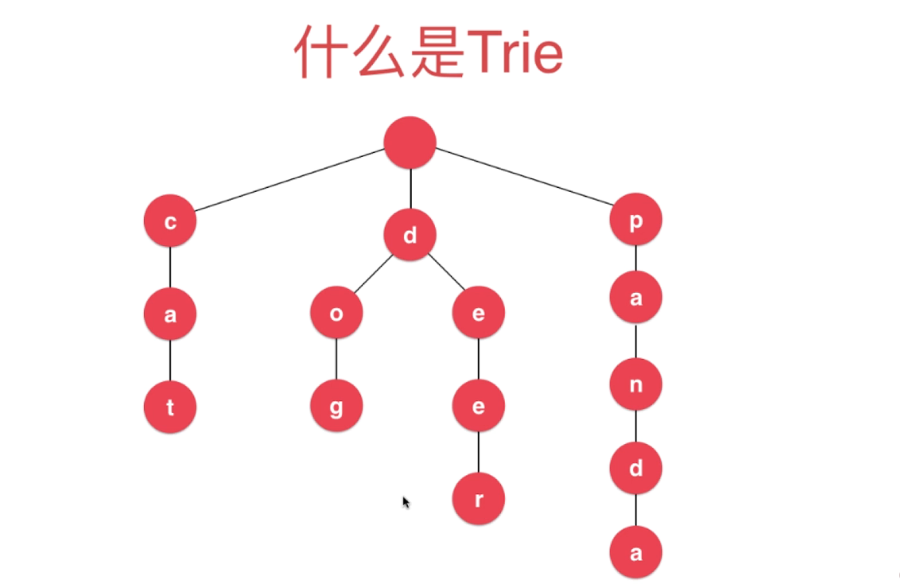

# 字典树复杂度
查询的复杂度和总的条目无关，只和单词的长度有关。
比如说查询的长度为w，那么复杂度就是O(w)。

# 字典树的节点
因为字典树的特殊用途，所以暂时先不考虑泛型。
```java
private class Node {
    public boolean isWord;
    public TreeMap<Character, Node> next;

    public Node(boolean flag) {
        this.isWord = flag;
        next = new TreeMap<>();
    }
}
```
## 属性
isWord使用来标记从字典树到这个节点的所有字符是不是一个字符串。
next表示当前字符的下一个字符。

因为是从根节点开始直接指向根节点的下一个节点，再由节点指向节点们的下一个节点，所以就是Node里面不用存储具体字符的值。
## 结构


# 字典树的操作逻辑
## 插入操作
要认识到字典树的结构是根节点为空，然后根节点里面是一个map(n叉树)，在给字典树里面构造字符串的时候，逐个遍历每个字符，然后给每个字符都造对应的节点，并且前面的字符是后面字符的父节点。
```java
public void add(String word) {
    //从字典树根节点开始遍历
    Node cur = root;

    for (int i = 0; i < word.length(); i++) {
        char c = word.charAt(i);
        //查看当前节点下面是否有c字符
        if (!cur.next.containsKey(c)) {
            //如果没有就拼接上c
            cur.next.put(c, new Node());
        }
        //更新cur的位置
        cur = cur.next.get(c);
    }

    //走到字符串的最后一个节点，把最后一个节点的isWord设置为true
    //表示到这里是一个字符串
    if (!cur.isWord) {
        size++;
        cur.isWord = true;
    }
}
```
## 查询某个字符串是否存在
和插入的逻辑很像，也是从上到下遍历每个字符，遇到没有的字符就返回false，遍历到最后一个字符的时候，要检查对应的节点里面的isWord属性是否是true，因为某个字符串可能是另一个字符串的前缀，所以要检查到最后一个节点是否是一个字符串。
```java
public boolean contains(String str) {
    //和插入的逻辑差不多，也是从根节点开始寻找
    Node cur = root;
    for (int i = 0; i < str.length(); i++) {
        char c = str.charAt(i);
        //如果当前节点下面没有找到c，说明就没有这个字符串
        if (!cur.next.containsKey(c))
            return false;

        cur = cur.next.get(c);
    }
    //找到字符串的最后一个节点，可能这个节点是另一个字符串的前缀，所以要看到这个节点是不是一个字符串
    return cur.isWord;
}
```

## 查询一个字符串是否是另一个字符串的前缀
和在字典树中是否存在某个字符串的逻辑一样，只要能遍历到最后的节点就说明存在这个前缀。
```java
public boolean isPrefix(String prefix) {
    Node cur = root;
    for (int i = 0; i < prefix.length(); i++) {
        char c = prefix.charAt(i);
        if (!cur.next.containsKey(c))
            return false;

        cur = cur.next.get(c);
    }
    return true;
}
```